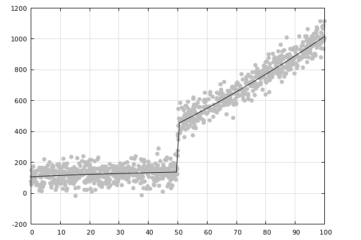

# JOINTLY LEARNING TRANSFORMATIONS AND FITTING A REGRESSION

## Introduction

Models -- such as generalised linear regressions -- can
be made more powerful by transforming the data first in
such a way that it fits the model assumptions better.
We can go further and jointly fit the parameters of the
transformation and the regression simultaneously, such
that the transformation is not "blind", but serves
directly to improve model fit. Moreover, we can chain
transformations/models together to achieve flexible
parameterised pipelines all parts of which are jointly
optimised.

There are two main facilitators for this way of modelling:
(1) differentiable programming *ala* autodiff and gradient
descent, and (2) global optimisation. Point 1 is well
suited to fitting neural network architectures and well
behaved continuous parametric functions. Point 2 is moreso
how scientists have been fitting all sorts of parametric
models since the 80s, which is the approach I've taken in
this demonstration.

Statistical models are typically conceived as invertable
parametric functions. That is, we start with some function
which we imagine generates the data we are seeing, and then
implement some procedure to recover the function parameters
from the data. Take for example a power transform attached
to a linear regression:

$$ y = \alpha g(x;\lambda) + \beta $$

where $g(x;\lambda)$ is the power transform parameterised
by $\lambda$, and $\alpha,\beta$ are the coefficients of a
linear regression. You can think of it as using a power 
transform to "flatten" the data before fitting it, and it
has the effect of making drastically more data series
amenable to simple linear regression.

## A flexible non-linear function

In this demonstration I will use the following data
generating function:

1. Start with a straight line: $y = ax + b$.

2. Pick a point somewhere along the line and divide the
   line into two segments.

3. Power transform each segment: I use the
[Yeo-Johnson](https://en.wikipedia.org/wiki/Power_transform#Yeo%E2%80%93Johnson_transformation)
   transform because its parameter is not range bound
   making it convenient for optimisation.
   
4. Add some Gaussian noise to each data point. I use the
   Box-Muller transform to convert points sampled from a
   uniform distribution into a Gaussian.

The result is a non-linear function with a vast variety
of possible shapes. I won't pursue it here, but in the
general case, we could have $n-1$ change points and $n$
power transforms. Here are the equations describing the
data generating function:

$$ sig(x, x_0) = 1 / (1 + e^{-50(x-x_0)})$$

$$ y = yeo(x,\lambda_1) * (1-sig(x,x_0)) + yeo(x,\lambda_2)*sig(x,x_0) + \epsilon $$

where $yeo$ is the Yeo-Johnson transform, and $\epsilon \sim N(0, \sigma^2)$.

Here is a plot of what it looks like with the following
parameters:
$x_0=50,\lambda_1 =0.7,\lambda_2=1.4,\alpha=2,\beta= 100,\sigma = 50$


## Recovering the parameters from data

The practical applications of this exercise emerge in 
the reverse direction wherein we have the data, assume
that it fits our model, and wish to recover the model
parameters from it. Whether the model is true or not
does not necessarily matter, as long as the shape of
the data is within the range of the model, it can still
be utilised for useful work.

Since the sigmoid is essentially flat on either side
of $x_0$, the gradient of $x_0$ is not very
informative for most starting points, making this
function very difficult to fit with gradient descent.
I've opted instead for an amazing yet little known
variant of simulated annealing called
[threshold accepting](https://ia800704.us.archive.org/view_archive.php?archive=/24/items/wikipedia-scholarly-sources-corpus/10.1016%252F0019-1035%252889%252990014-6.zip&file=10.1016%252F0021-9991%252890%252990201-B.pdf) annealing, herein implemented
in 9 lines of code.

Here is a sketch of the solution:

1. Write down the cost function: $\sum_i (y_i - \hat{y_i})^2$.
   Its just the sum of square differences between the
   predict $\hat{y_i}$ and the actual value $y_i$.
   
2. Write down the perturbation function which generates
   the next candidate solution taking the current
   solution as an argument. The function herein just
   adds some random noise to the current solution to
   generate a new candidate and progressively modifies
   fewer parameters as the optimisation goes on (see
   Notes).

3. Implement threshold accepting annealing.

4. Apply it to some data generated from the function
   given above.
   
The results are very good especially given an algorithm
of such simplicity. If I set $\sigma=0$ for the data 
generating function I can recover the parameters almost
perfectly: 

```
SSE = 2.41737473692175

x0 = 50.00012595144228
l1 = 0.7002187213885587
l2 = 1.4006478656514114
a  = 1.9949945599502708
b  = 100.06270480468355
```

Meanwhile, here are the results for the noisy function:

```
SSE = 2463477.4443425345,

x0 = 50.00456239383456,
l1 = 0.6207606244772877
l2 = 1.4132729980396663
a  = 1.89497964824292
b  = 105.48395165961668
```




## Running it

```
ghc -O2 analysis.hs && ./analysis
gnuplot plot-example.gp > example.png
gnuplot plot-fitted.gp > fitted.png
```

## Notes

1. $\lambda_1,\lambda_2$ are very sensitive to small
   differences so using the `Double` data type is
   essential.
   
2. The starting vector used was `[0,1,1,1,1]`:
   nowhere near the actual values.  The algorithm is
   surprisingly robust to initial values.
   
3. The threshold schedule is very important for
   convergence. I found that a small number of
   iterations spent over a large number of monotonically
   decreasing thresholds makes convergence most likely.

4. The perturbation function stochastically reduces the
   number of parameters modified as the optimisation
   progresses. This is essential for best performance
   because if the solution is already close to the
   optimum, it is more likely that perturbation of
   fewer parameters will result in a better state
   than a perturbation of all parameters at once.
